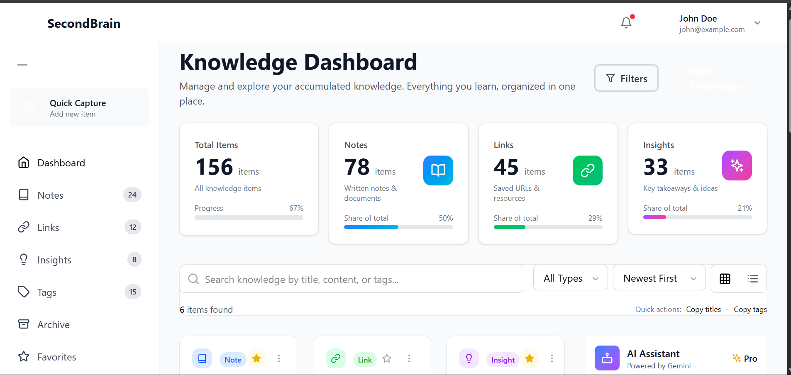
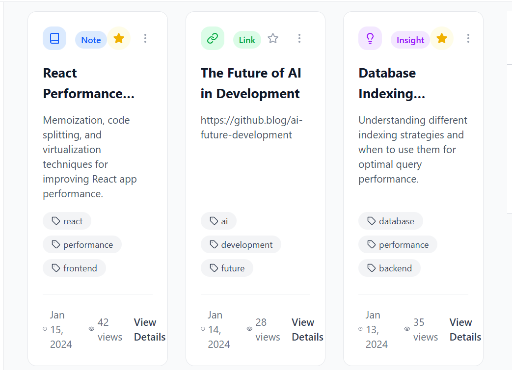
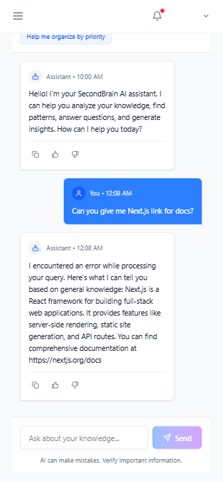

# Second Brain App

A **modern, responsive full-stack web application** for managing and organizing knowledge resources such as **notes, links, and insights** with a clean UI and scalable backend.

---

## Live Demo

- **Live Application:** https://second-brain-app-client.vercel.app
- **Backend API:** https://second-brain-app-3efe.onrender.com
- **Documentation:** https://second-brain-app-client.vercel.app/docs


##  Demo & Screenshots
> A quick visual walkthrough of the Second Brain App highlighting core features, UI polish, and AI interactions.

### Dashboard & Knowledge Management


### Knowledge Capture & Tagging


### AI Summarization & Chat



---

## Features

### 🔹 Core Functionality
- **Smart Capture** – Capture notes, links, and insights with AI-powered auto-tagging
- **AI Processing** – Automatic summarization, intelligent categorization, and conversational querying
- **Advanced Search** – Semantic search across all knowledge items with relevance scoring
- **Flexible Organization** – Tag-based categorization with nested tag support
- **Analytics Dashboard** – Track knowledge growth, usage patterns, and insights generation
- **Secure Storage** – End-to-end encryption and secure access controls

### 🔹 Advanced Features
- Real-time AI Chat Interface – Ask questions about your knowledge base
- Public API Access – Access your knowledge from anywhere via REST API
- Responsive Design – Fully optimized for desktop, tablet, and mobile
- Micro-interactions – Smooth animations and transitions throughout

### 🔹 Performance & Security
- Optimized rendering using memoization
- JWT-based authentication
- Encrypted sensitive data
- Offline support (PWA-ready)

---

## 🛠 Tech Stack

### Frontend
- React 18
- Next.js 14 (App Router)
- Tailwind CSS
- Framer Motion
- React Hook Form
- React Query
- Zustand (Store)

### Backend
- Node.js
- Express.js
- MongoDB + Mongoose
- JWT Authentication
- Google Gemini API
- Multer (File uploads)

### Deployment
- **Frontend:** Vercel
- **Backend:** Render
- **Database:** MongoDB Atlas

---

## Architecture Principles

- **Portable Architecture** – Clear separation of concerns with swappable components
- **Principles-Based UX** – Documented design principles guiding AI interactions
- **Agent Thinking** – Automated processing that improves the system over time
- **Infrastructure Mindset** – Public API exposing system intelligence

---

## Dev & Tooling

- ESLint & Prettier
- VS Code
- Postman API
- Google Gemini API

---

## UI / UX Features

### Design Principles
- **Progressive Disclosure** – Show only what's necessary, reveal more on demand
- **Immediate Feedback** – All actions provide instant visual feedback
- **Consistency** – Uniform design patterns across the application
- **Accessibility First** – Semantic HTML, ARIA labels, keyboard navigation

### Interactive Elements
- Smooth Animations – Framer Motion transitions
- Micro-interactions – Hover states, loading skeletons
- Responsive Layouts – Adapts to all screen sizes
- Keyboard Navigation – Full keyboard support

---

## API Endpoints

### Authentication
```bash
POST /api/auth/register   # User registration
POST /api/auth/login     # User login
POST /api/auth/logout    # User logout

GET    /api/items                # Get all items (with filtering)
POST   /api/items                # Create new item
GET    /api/items/:id            # Get single item
PUT    /api/items/:id            # Update item
DELETE /api/items/:id            # Delete item
POST   /api/items/:id/favorite   # Toggle favorite

```

---

### Folder Structure
```
second-brain-app/
│
├── client/
│   ├── public/
│   ├── src/
│   │   ├── app/
│   │   ├── components/
│   │   │   ├── ai/
│   │   │   ├── common/
│   │   │   ├── knowledge/
│   │   │   ├── layout/
│   │   │   └── ui/
│   │   ├── hooks/
│   │   ├── lib/
│   │   ├── store/
│   │   └── styles/
│   │       └── globals.css
│   │
│   ├── next.config.js
│   ├── tailwind.config.js
│   ├── postcss.config.js
│   ├── jsconfig.json
│   ├── package.json
│   └── README.md
│
├── server/
│   ├── config/
│   ├── controllers/
│   ├── middleware/
│   ├── models/
│   ├── routes/
│   ├── services/
│   ├── .env
│   ├── app.js
│   ├── server.js
│   └── package.json
│
├── .gitignore
├── package.json
└── README.md

```

### Quick Start
**Prerequisites:**
- Node.js 18+ installed
- MongoDB Atlas account (or local MongoDB)
- Google Gemini API key

```
Installation
Clone the Repository
git clone https://github.com/mdakram2002/second-brain-app.git
cd second-brain-app

Backend Setup
cd server
npm install
cp .env.example .env
# Edit .env with your credentials
npm run dev


Backend runs on: http://localhost:5000

Frontend Setup
cd client
npm install
cp .env.local.example .env.local
# Edit .env
npm run dev


Frontend runs on: http://localhost:3000

```

### Environment Variables
```
Backend (.env)
MONGODB_URI=your_mongodb_connection_string
GEMINI_API_KEY=your_google_gemini_api_key
JWT_SECRET=your_jwt_secret_key
NODE_ENV=development
PORT=5000
CLIENT_URL=http://localhost:3000

Frontend (.env.local)
NEXT_PUBLIC_API_URL=http://localhost:5000
```


### Available Scripts
```
Backend
npm run dev      # Start development server
npm start        # Start production server
npm test         # Run tests

Frontend
npm run dev      # Start development server
npm run build    # Build for production
npm start        # Start production server
npm run lint     # Run ESLint

```

### 🙏 Acknowledgments
- Altibbe / Hedamo for the inspiring assignment
- Google Gemini AI for powerful AI capabilities
- Vercel & Render for deployment platforms
- The open-source community for fantastic tools and libraries